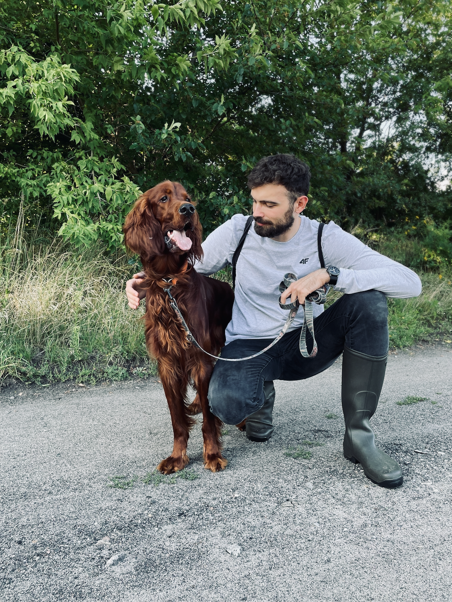

### Profile

Self-made wannabe hacker with engineering background. I am a graduate of the
**AGH University of Science and Technology** in Cracow and *University of
Lodz*. I am mainly interested in web technologies and operating systems from
the Linux family. I am an enthusiast and an advocate of
[Free](https://en.wikipedia.org/wiki/Free_software) and [Open
Source](https://en.wikipedia.org/wiki/Open-source_software) software. I'm
highly enjoying using bleeding edge technologies, especially modern programming
languages such as Go, Rust or Elixir. In my free time I try to develop my
private projects (check [my Github profile](https://github.com/thinkofher)!)
and broaden my knowledge of programming techniques.

### Quick facts

- Loves minimalist software.
- Spends most of the time in the terminal emulator.
- Devoted
  [vim user](https://github.com/thinkofher/dotfiles/blob/main/.config/nvim/init.lua).
- Can't imagine what the world was like without containers.
- Is obsessed with improving development tools.

### Experience

- Poznan, [OLX Group](https://www.olxgroup.com/)
  - 02.2022 - now, **Software Engineer**. Currently I'm working as a Golang
    Software Enginner at OLX Group. I'm extending functionalities of multiple
    OLX Real Estate SaaS services (for example: [Otodom](https://otodom.pl)),
    backed by microservice architecture and AWS serverless solutions.
- Warszawa, [Grupa Wirtualna Polska](https://holding.wp.pl/en)
  - 03.2021 - 01.2022, **Backend Developer**. I was a part of the team
    responsible for maintenance of [1login.wp.pl](https://1login.wp.pl/) and
    [poczta.wp.pl](https://profil.wp.pl/).

    During my time in WP I was able to interact with a lot of different industry
    standards for distributed systems, such as: mail protocols (IMAP, POP3) or
    authorization and authentication protocols (OAuth, OpenID, WebAuthn). I've
    done some R&D (mainly for WebAuthn) and systems design, especially for web
    JSON APIs. I learned a lot about NoSQL databases, their advantages and
    disadvantages in terms of use within the microservice architecture.
- Lodz, Fujitsu Technology Solutions
  - 06.2020 - 02.2021, **R&D Associate Software Developer**. I was mainly
    developing embedded firmware for Fujitsu Server Primergy and managing
    infrastructure for development.
  - 01.2020 - 06.2020, **R&D Intern**. Most of the time I was developing suite
    for automatic functional tests for Fujitsu Redfish API implementation. I
    started this project from scratch and I was using mostly Python and gauge.

### Education

- 2020 - 2023, **Computer Science**, _Faculty of Mathematics and Computer
  Science, University of Lodz_. Thesis: "[HTTP server](https://code.hauru.club/okrzeja)
  with an embedded database adapted to the needs and goals of IT education"

- 2019, **Computer Science**, _Faculty of Electrical, Electronic, Computer and
  Control Engineering, Lodz University of Technology, Lodz_

- 2015 - 19, **Bachelor’s degree, Civil Engineering**, _Faculty of Mining and
  Geoengineering, AGH University of Science and Technology, Krakow_. Thesis:
  "The design of the route and construction of the roller coaster with extreme
  feelings of use"

### Additional Activities

- 2020 - now, **Founding Member** of
  [Hackerspace Lodz](https://github.com/hakierspejs/wiki/wiki/O-nas),
  organisation which unites people who enjoy open source software, hardware and
  free culture

- 2018 - 19, **Member of the Board, Founder, Treasurer**
  [of student research group "Aksjator"](https://www.facebook.com/aksjator/)

- 04.2019 - **1st place**, Research Paper Competitions (Master's category), 9th
  National Conference of Civil Engineering Students and PhD Students
  EUROINŻYNIER.

- 12.2018 - **2nd place**, The Civil Engineering Section of the 59th Student
  Conference of Student Research Groups of the Mining Division of the AGH.

### Skills

| **Programming**  | `Go C JavaScript Lua Rust Python C++`                  |
| **Tools**        | `Vim Linux macOS Git Zsh Bash Docker Podman Terraform` |
| **Technologies** | `Flask Redis PostgreSQL GitLab AWS`                    |

### Languages

- Polish - Native speaker
- English - B2 Upper-Intermediate

