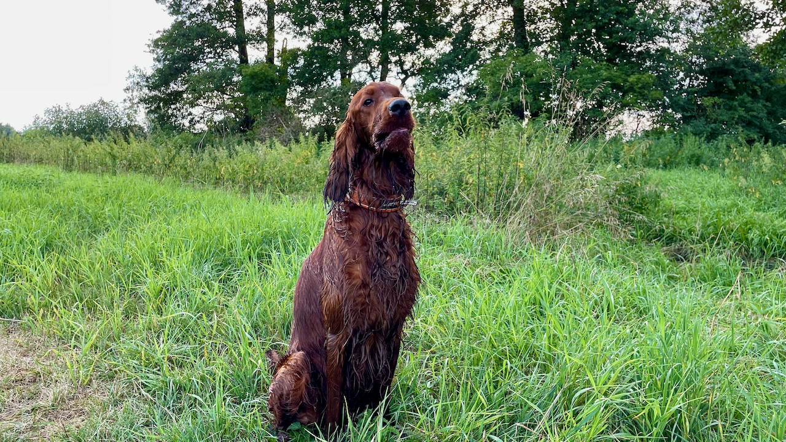
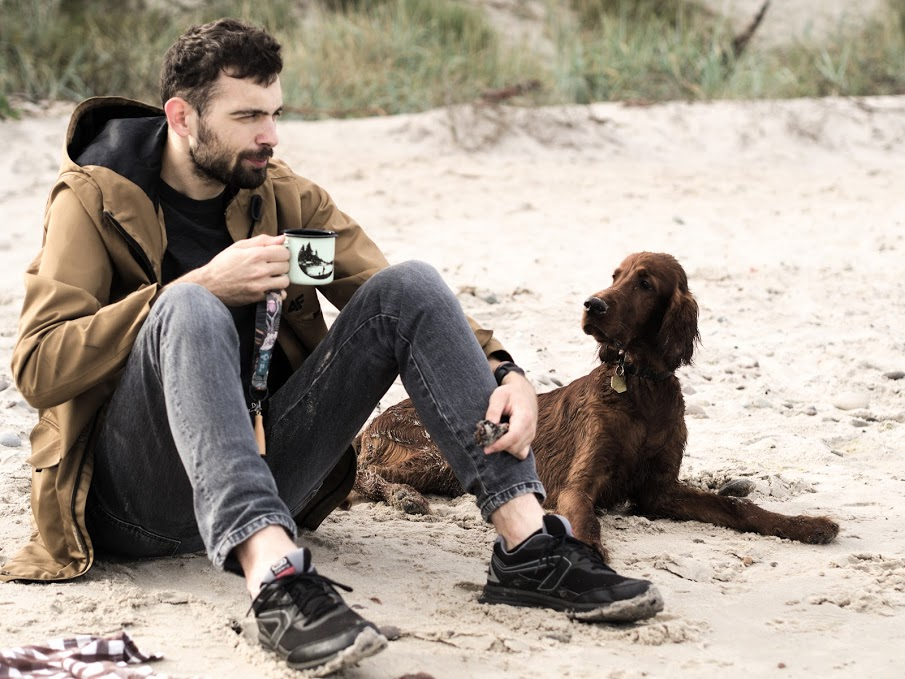

I guess this is it. My personal space in the middle of world
wide web. I don't have any particular idea for this place.
I will probably upload some stuff, write about my projects and
try my hand in technical writing. I really enjoy reading about
people struggling with modern technologies during their work
on different projects. It's both entertaining and informative,
so I want to take a part in this trend. Also, expect some
[setters](https://en.wikipedia.org/wiki/Setter) from time
to time.

My latest post on the blog: __"[{{ site.posts[0].title }}]({{ site.posts[0].url }})"__.

If you came here in hope for some collaboration, you're more
than welcome. Check out [about](/about) page and visit my
[projects](/projects). This will give you a brief overview
of my competencies.

